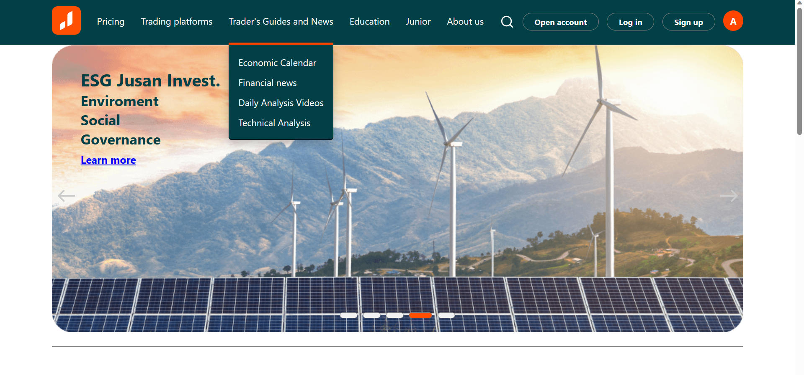

# invest-app

## Описание

Данный проект является приложением для инвестиций.

Приложение содержит:

- Главную страницу с галереей компаний.
- Страницу регистрации.
- Страницу авторизации.
- Страницу "детали компании".

На каждой странице есть header и footer.

header содержит:

- Логотип приложения.
- Навигация.
- Поиск (Поиск происходит по названиям компаний или тикерам).
- Кнопка открытия счета.
- Кнопку авторизации и регистрации.

footer содержит:

- логотип Jusan со ссылкой на Jusan Invest.

Главная страница приложения содержит карточки компаний.

В каждой карточке есть:

- Логотип компании.
- Название компании.
- Актуальная стоимость акций компании.

При нажатии на карточку открывается страница с детальной информацией компании.

Cтраница "детали компании" содержит:

- Логотип компании.
- Название компании.
- График цены за час, день, неделю, месяц, 6 месяцев, год и все время.

Поля на странице авторизации:

- Логин
- Пароль

Поля на странице регистрации:

- email
- Логин
- Пароль

На странице регистрации происходит валидация полей формы. Проверка срабатывает на `focus/blur`, a также на событие `submit`.
При переходе на недействительный роут открывается страница 404.

Валидация:

- email — стандартная проверка: латиница, может содержать спецсимволы и цифры, обязательно должна быть «собачка» (@) и точка после неё, но перед точкой обязательно должны быть буквы. Не должен содержать пробелы.
- Логин — от 3 до 15 символов, только латиница. Без пробелов, без спецсимволов, кроме нижнего подчеркивания и дефиса. Может содержать числа, но не полностью состоять из них.
- Пароль — от 8 до 30 символов, обязательно хотя бы один спецсимвол и цифра.

# Запуск проекта

- Скачать проект.
- Установить: `$ npm i`.
- Запустить проект: `$ npm start`.

Проект запускается на порту 3000.

# Ссылка на домен

# Screenshots

  

  
  
  

